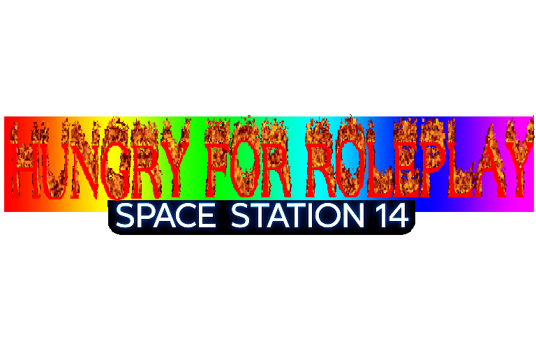

  

# NOT STARLIGHT
Space-Station 14

HI

STARLIGHT is a COOL FORK,

## License

> [!NOTE]
> **Relicensing in progress.** The Starlight Fork License (`LICENSE-Starlight.TXT`) was applied to Starlight contributions
> from **2024-11-04** (commit `84205e38`) through **2026-02-28** (commit `01eff0f7`).
> This license **remains in effect** for contributions made during that period until explicit relicensing
> consent is received from the respective authors. Once consent is given, those contributions are relicensed under MIT.
> All contributions outside of that range are licensed under MIT (`LICENSE.TXT`).
> Relicensing requests are tracked in [issue #3499](https://github.com/ss14Starlight/space-station-14/issues/3499).

### Click each banner for further information

---

>Some files are licensed under [MIT license](https://opensource.org/license/MIT), these files are Space Wizards Federation code.

>All other non-code STARLIGHT Assets, including icons and sound files, are licensed under the [Creative Commons 3.0 BY-SA](https://creativecommons.org/licenses/by-sa/3.0/) license unless otherwise noted in the folder or file.

